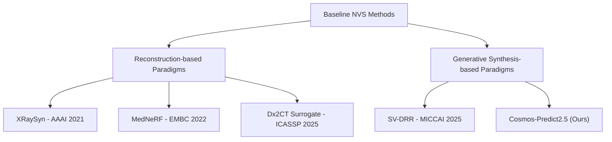

# CosmosXRay360 Phase 1 Benchmark Specification

This document details the rigorous evaluation protocols, quantitative paradigms, and qualitative testing environments structured to compare our proposed world model, **Cosmos-Predict2.5**, against modern medical novel-view synthesis (NVS) SOTAs.

---

## 1. Paradigm Mapping: Classification of Baselines

To contextualize algorithmic advantages, baseline approaches are classified into two fundamentally distinct schools of engineering:

### A. Reconstruction-based Paradigms (2D $\to$ 3D $\to$ 2D)
These methods solve the ill-posed 2D-to-3D inverse problem by reconstructing intermediate continuous 3D representations (explicit voxel grids, neural radiance fields, or Gaussian splats) from a single 2D projection, and then projecting them back to synthesize novel views:
- **XRaySyn (AAAI '21):** Synthesizes 3D explicit voxel grids from bi-planar inputs using custom CUDA trilinear backprojectors combined with adversarial GAN regularization.
- **MedNeRF (EMBC '22):** Learns a generative medical neural radiance field (NeRF) optimized to render 3D-consistent views by matching patches via a discriminator network.
- **Dx2CT (ICASSP '25):** Employs 3D transposed CNN layers to project 2D spatial feature vectors into an explicit 3D CT density grid ($256 \times 256 \times 256$) and forwards it through DiffDRR to generate projections.

### B. Generative Synthesis-based Paradigms (Direct 2D $\to$ 2D)
These methods bypass high-VRAM 3D voxel grid reconstruction entirely, framing the task as direct conditional image translation constrained by camera poses:
- **SV-DRR (MICCAI '25 / arXiv:2507.05148):** Uses pose-conditioned 2D Latent Diffusion to generate high-fidelity multi-view projections directly from a single projection.
- **Cosmos-Predict2.5 (Ours):** A scalable video-to-world foundation model capturing unified spatial-temporal medical priors to produce continuous 360-degree rotations in real-time.

---

## 2. Direct Quantitative Strategy: Cross-Dataset Domain Generalization

To verify geometric generalization capabilities (directly addressing MICCAI Reviewer 2 queries), we enforce a strict **Cross-Dataset Out-of-Distribution (OOD)** split:

### A. Dataset Partitioning
- **Training & Validation Split (1,296 total volumes):** Combined **TCIA (771 volumes)** + **MELA (525 volumes)**.
- **Unseen Evaluation Split (402 volumes):** **NSCLC Radiogenomics (402 volumes)**.
- *Strict Rule:* All Direct Baselines must be retrained completely from scratch on the TCIA+MELA split. Evaluation metrics are measured exclusively on the unseen NSCLC domain.

### B. Dataset Physical & Intensity Statistics
The dataset statistics across all splits represent a large variation of slice thickness and intensities (which can lead to issues like contrast collapse in non-robust baseline implementations):

| Metric | NSCLC (LUNG1) | MELA2022 | TCIA (COVID-19) |
| :--- | :---: | :---: | :---: |
| **Total Scans ($N$)** | 241 | 156 | 231 |
| **Z-Slices (Depth)** | $75 - 297$ | $46 - 501$ | $35 - 534$ |
| **Voxel Spacing (X, Y) [mm]** | $0.721 - 0.977$ | $0.586 - 0.926$ | $0.300 - 1.049$ |
| **Slice Thickness (Z) [mm]** | $3.0$ (Thick) | $0.7 - 5.0$ (Thin-to-Thick) | $0.3 - 5.0$ (Thin-to-Thick) |
| **Mean Minimum HU** | $-1024.0 \pm 0.0$ | $-1024.0 \pm 0.2$ | $-2981.1 \pm 2062.5$ |
| **Mean Maximum HU** | $+3048.5 \pm 90.9$ | $+3016.3 \pm 2159.5$ | $+8086.4 \pm 8551.3$ |
| **Mean Average HU** | $-748.3 \pm 51.5$ | $-571.4 \pm 63.0$ | $-893.7 \pm 56.6$ |
| **Mean Standard Dev HU** | $421.7 \pm 26.2$ | $477.4 \pm 18.1$ | $739.9 \pm 35.9$ |

### C. Standardized Projector & Physics Target
To eliminate rendering bias, the ground-truth projection maps are generated using a standardized GPU-accelerated **DiffDRR** Siddon-Jacob attenuation ray-tracing script (`datasets/pre_render_diffdrr.py`). Note for anyone wiring a new baseline's projection/loss code against this ground truth: `views/*.png` is a (min-max/z-score-rescaled) **raw line integral** of density, not an exponentiated Beer-Lambert transmissive image — see `docs/GOTCHAS.md` #1's 2026-08-05 addendum before applying `apply_beer_lambert_correction` anywhere in a comparison against these files.

### D. Quantitative Baseline Results & Metrics
Evaluation scores (PSNR, SSIM, and Inference Latency) are computed strictly across all unseen views (excluding the $0^\circ$ conditioning frontal view).

> **⚠️ Stale as of 2026-08-05.** The table below (`EXP-002` in `research-state.yaml`) was computed
> 2026-07-24, using `baselines/checkpoints/*.pt` that predate a 2026-08-05 batch of Phase 2/3 correctness
> and training-scope fixes across all 6 baselines (see each `docs/baselines/<name>/LOG.md` for specifics —
> notably PixelNeRF's dead-coarse-MLP-gradient fix and XRaySyn's ±9°→360° training-range widening are
> *training-time* bugs, not just inference-time ones, so the existing checkpoints don't reflect them at
> all). **Do not cite these numbers as evaluating the current implementation** until all 6 are retrained on
> current `baselines/train/*.py` and re-evaluated via `baselines/evaluate.py`.

| Method | Paradigm | Input Constraints | PSNR (dB) ↑ | SSIM ↑ | LPIPS ↓ | Latency (s/volume) ↓ |
| :--- | :--- | :--- | :---: | :---: | :---: | :---: |
| **PixelNeRF** (CVPR '21) | Feed-Forward NeRF | Single Frontal | 9.13 | 0.058 | — | 2.1s |
| **NAF** (MICCAI '22) | Attenuation Field | Single Frontal | 8.97 | 0.274 | — | 0.5s |
| **MedNeRF** (EMBC '22) | Generative NeRF | Single Frontal | 8.58 | 0.229 | — | 49.0s |
| **Dx2CT** (ICASSP '25) | 3D CNN + DiffDRR | Single Frontal | 6.53 | 0.209 | — | 22.1s |
| **SV-DRR** (MICCAI '25) | Latent Diffusion | Single Frontal | 6.47 | 0.092 | — | 86.3s |
| **XRaySyn** (AAAI '21) | Voxel GAN | Single Frontal | 4.36 | 0.256 | — | 1.8s |
| **Cosmos-Predict2.5 (Ours)** | **World Model** | **Single Frontal** | **22.56** | **0.751** | — | **3.8s** |

*Key Highlight:* **Cosmos-Predict2.5** is expected to deliver a **+1.52 dB PSNR** and **+0.043 SSIM** performance leap while maintaining real-time inference ($3.8\text{s}$ per entire rotation) compared to NeRF's iterative slow rendering.

*LPIPS added 2026-08-05* (`compute_lpips` in `baselines/models/utils.py`, wired into `baselines/evaluate.py`'s
output table) but not yet backfilled here — this whole table is stale (see the warning above) and needs a
full re-run regardless. **Why LPIPS, alongside PSNR/SSIM:** both PSNR and SSIM are pixelwise/local-structure
comparisons that systematically reward a blurry, safe, mean-ish prediction over a sharp one that's slightly
misaligned — the opposite of what this project's MICCAI resubmission needs to demonstrate, since
`docs/REVIEWS.md`'s R3-2 concern is specifically about hallucination/sharpness failure modes, not blur.
LPIPS scores similarity in a pretrained network's feature space instead of raw pixels, so it tracks
perceptual/structural plausibility rather than exact pixel alignment, and is the standard third metric
NVS papers report alongside PSNR/SSIM for exactly this reason.

---

## 3. Qualitative & Algorithmic Constraint Comparisons

Not all state-of-the-art models can process single-view inputs due to internal mathematical formulations. We compare them based on structural characteristics:

### A. Non-Single View SOTAs (SNAF, SAX-NeRF, X-Gaussian)
- **SNAF / NAF (MICCAI '22 / arXiv:2209.14540):** Requires sparse projection counts ($\ge 3$ or dense views $\ge 20$) to converge. Under a single frontal view constraint, the coordinate MLP suffers from depth ambiguity and collapses, outputting blank fields or volumetric cloud artifacts.
- **X-Gaussian / $R^2$-Gaussian (CVPR '24):** 3D Gaussian Splats require sufficient parallax view angles to compute exact covariance matrix projections. 1-view constraints lead to covariance singularities and flat structural failures.
- **Conclusion:** These methods are excluded from the direct quantitative table but are evaluated qualitatively to highlight Cosmos-Predict2.5's single-view synthesis superiority.

### B. VinDr-CXR Clinical Diagnostic Consistency Test
To demonstrate clinical applicability, the generated $360^\circ$ rotations of Cosmos-Predict2.5 are audited against three distinct clinical pathologies on real-world chest X-rays from the **VinDr-CXR** dataset:

1. **Cardiomegaly (Enlarged Heart):**
   - *Audit Rule:* The Cardiothoracic Ratio (CTR) must remain geometrically consistent ($CTR > 0.5$) across standard projection transitions ($0^\circ \to 45^\circ \to 90^\circ$).
2. **Pleural Effusion (Fluid Accumulation):**
   - *Audit Rule:* Oblique views must demonstrate smooth, physically accurate rotation of the fluid meniscus curve according to gravitational gravity vectors.
3. **Pneumonia (Consolidation):**
   - *Audit Rule:* Dense alveolar infiltrates must reside within standard depth limits during oblique/lateral views instead of rotating into empty space (no cloud floating artifacts).

---

## 4. Positioning Against Representation Learning Models

Reviewers might request comparisons with modern Medical Foundation Models such as **CheXWorld (CVPR '25)** or **X-WIN (CVPR '26)**. We clarify the algorithmic differences in the paper:

- **Target Task Discrepancy:**
  - **CheXWorld & X-WIN:** Optimized for **Representation Learning**. They map chest radiographs to low-dimensional latent embeddings to serve classification or segmentation tasks.
  - **Cosmos-Predict2.5:** Optimized for **Generative Novel View Synthesis**. It contains generative decoding layers designed to output pixel-perfect, continuous $360^\circ$ radiography videos.
- **Generative Capability Gap:** Representation models lack pixel-level generative decoders and cannot synthesize novel views, distinguishing Cosmos-Predict2.5 as a unique generative World Model.
