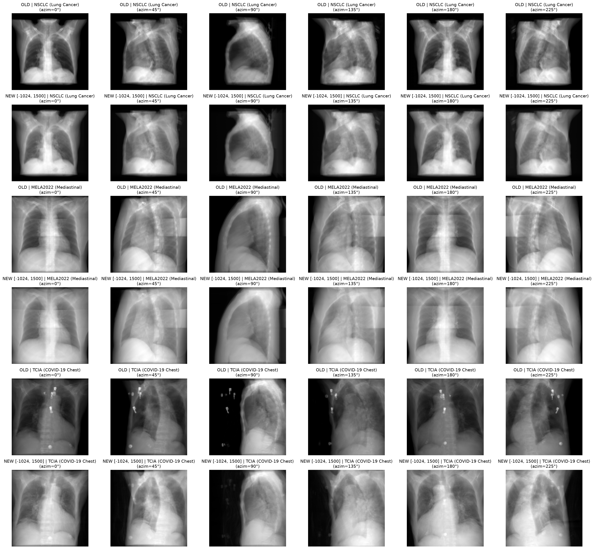
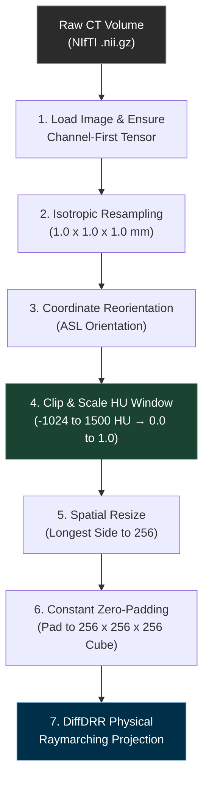

# Exploratory Data Analysis for CT Datasets

**Abstract.** This document reports a full-cohort exploratory data analysis (EDA) of the three
clinical CT datasets underlying **CosmosXRay360** — **NSCLC** (LUNG1, lung carcinoma), **MELA2022**
(mediastinal lymphadenopathy), and **TCIA** (COVID-19 chest CT) — and derives, from that analysis,
the Hounsfield Unit (HU) intensity-clipping window used throughout the preprocessing and rendering
pipeline. We first characterize the acquisition and intensity statistics of all $N = 628$ volumes
(§2), identify a scanner-artifact failure mode specific to the TCIA cohort (§3), and resolve it via
a two-stage, metric-driven grid search over the clipping window (§4). The resulting window,
$[-1024, 1500]$ HU, is grounded both empirically (entropy/saturation optimality) and physically
(the cortical-bone radiodensity ceiling), and is implemented as the single source of truth in the
MONAI (Medical Open Network for AI) preprocessing pipeline (§5). An interactive companion notebook,
`scripts/eda_dataset.ipynb`, reproduces the statistics and figures in §2–§3 directly from the raw
data; the grid search in §4 is reported as previously verified results (see the reproducibility
note in §4.4).

---

## 1. Out-of-Distribution (OOD) Evaluation Protocol

To guarantee unbiased evaluation and eliminate data leakage across clinical sites, scanner models,
and patient populations, the three cohorts are partitioned into a strict cross-dataset
**out-of-distribution (OOD)** split:

$$\text{Train Set: TCIA (COVID-19) + MELA2022} \quad \longrightarrow \quad \text{Test Set: NSCLC (LUNG1)}$$

- **Training domain (TCIA + MELA2022).** Combines multi-center clinical trials and open-source
  chest scans representing varied acquisition protocols, thin/thick slice distributions, and
  thoracic pathologies.
- **Evaluation domain (NSCLC).** Held-out radiation-therapy planning scans from Maastro Clinic
  (Netherlands) with thick-slice acquisitions ($3.0\text{ mm}$), testing zero-shot generalization
  to unseen hospital hardware.

---

## 2. Cohort Characteristics

Table 1 summarizes acquisition parameters and intensity statistics computed across the full cohort
of $N = 628$ clinical CT volumes ($241$ NSCLC + $156$ MELA2022 + $231$ TCIA). Per-volume statistics
(percentiles, min, max, mean, standard deviation) are computed over every voxel of every volume —
not a subsample — and reported here as the cohort mean $\pm$ standard deviation across volumes;
see `scripts/eda_dataset.ipynb` §1–§2 for the reproducible computation.

**Table 1.** Acquisition parameters and HU intensity statistics by dataset.

| Metric / Parameter | NSCLC (LUNG1) | MELA2022 | TCIA (COVID-19) |
| :--- | :---: | :---: | :---: |
| **OOD Partition Role** | Test Set (Held-Out) | Train Set | Train Set |
| **Total Scans ($N$)** | $241$ | $156$ | $231$ |
| **Acquisition Origin** | Maastro Clinic (Netherlands) | Multi-Center Clinical Trial | TCIA Open-Source Cohort |
| **Primary Pathology** | Thoracic Carcinoma (Lung) | Mediastinal Lymphadenopathy | Viral Pneumonia / COVID-19 |
| **Spatial Matrix $(H, W)$** | $512 \times 512$ | $512 \times 512$ | $512 \times 512$ |
| **Axial Slice Depth ($Z$)** | $75\text{–}297$ slices | $46\text{–}501$ slices | $35\text{–}534$ slices |
| **In-Plane Spacing $(X, Y)$** | $0.721\text{–}0.977\text{ mm}$ | $0.586\text{–}0.926\text{ mm}$ | $0.300\text{–}1.049\text{ mm}$ |
| **Slice Thickness ($Z$)** | $3.0\text{ mm}$ (thick) | $0.7\text{–}5.0\text{ mm}$ | $0.3\text{–}5.0\text{ mm}$ |
| **Mean Min HU** | $-1024.0 \pm 0.0$ | $-1024.0 \pm 0.2$ | $-2981.1 \pm 2062.5$ |
| **Mean Max HU** | $+3048.5 \pm 90.9$ | $+3016.3 \pm 2159.5$ | $+8086.4 \pm 8551.3$ (implant spikes) |
| **Mean Average HU** | $-748.3 \pm 51.5$ | $-571.4 \pm 63.0$ | $-893.7 \pm 56.6$ |
| **Mean Std. Dev. HU** | $421.7 \pm 26.2$ | $477.4 \pm 18.1$ | $739.9 \pm 35.9$ |

The TCIA cohort's Mean Max HU ($+8086.4 \pm 8551.3$) is an order of magnitude larger, and an order
of magnitude more variable, than the other two cohorts — a discrepancy investigated in §3.

---

## 3. Failure-Mode Analysis: Scanner and Hardware Artifacts

### 3.1 TCIA Metal-Implant Spikes and Contrast Collapse

**Physical mechanism.** Radiodensity is measured in Hounsfield units (HU), calibrated such that
air $= -1000\text{ HU}$, water $= 0\text{ HU}$, and cortical bone $\in [+400, +1500]\text{ HU}$.
Surgical clips, pacemakers, and other metallic hardware exhibit substantially higher densities,
reaching $+3000$ to $+28{,}348\text{ HU}$ in this cohort (e.g., TCIA scan
`volume-covid19-A-0012.nii.gz`). This is the source of Table 1's TCIA outlier statistics.

**Failure mode.** Dynamic min–max scaling without a fixed upper bound normalizes each volume by
its own maximum intensity:

$$V_{\text{norm}} = \frac{V - V_{\text{min}}}{V_{\text{max}} - V_{\text{min}}} \tag{1}$$

When $V_{\text{max}} = +28{,}348\text{ HU}$, normal cortical bone ($+1000\text{ HU}$) is scaled down
to $0.035$ (near-black), while soft tissue ($0\text{ HU}$) collapses toward air ($0.000$), producing
a faded, low-contrast projection — a failure mode we refer to as **contrast collapse**. Because
Eq. (1) is volume-global, a single outlier voxel degrades the normalization of the entire scan.

**Resolution.** Enforce a fixed upper ceiling at $+1500\text{ HU}$, the physical upper bound for
cortical bone (§4), discarding metallic outliers while preserving bone and parenchymal contrast.
Figure 1 shows this correction applied across all three datasets and six rotation angles, rendered
with the production DiffDRR pipeline (`renderers/diffdrr/`); §6 of the companion notebook
(`scripts/eda_dataset.ipynb`) generates the authoritative live results: comparing contrast restoration
across 3D orthogonal planes (Axial, Coronal, Sagittal) and multi-azimuth projections ($0^\circ, 45^\circ, 90^\circ, 135^\circ, 180^\circ$)
directly on the $+28{,}348\text{ HU}$ outlier volume.

**Figure 1.** DiffDRR-rendered projections before (`OLD`, per-volume dynamic scaling) and after
(`NEW`, fixed $[-1024, 1500]$ HU window) the correction, across NSCLC, MELA2022, and TCIA at six
azimuth angles. The TCIA row shows the clearest correction, consistent with §3.1.



### 3.2 Slice-Thickness Anisotropy

**Geometric distortion.** NSCLC radiation-therapy scans use thick slices ($3.0\text{ mm}$), while
MELA2022 and TCIA contain thin, near-isotropic slices ($0.7\text{–}1.0\text{ mm}$, Table 1).
Projecting un-resampled volumes directly introduces longitudinal distortion (organs squashed or
stretched along the $Z$-axis) and biases cross-dataset comparison.

**Resolution.** Resample all volumes to a uniform $1.0 \times 1.0 \times 1.0\text{ mm}$ isotropic
resolution via trilinear interpolation prior to rendering (pipeline stage 2, Figure 2).

---

## 4. Quantitative Grid Search: HU Window Selection

To determine the HU clipping window $[a_{\min}, a_{\max}]$, we ran a two-stage grid search over
representative CT volumes drawn from all three cohorts, staged as air-floor ($a_{\min}$, §4.2) then
bone-ceiling ($a_{\max}$, §4.3) — the two parameters are weakly coupled, so a staged sweep is used
in place of a full joint grid (see the dataset EDA methodology in `.claude/skills/dataset-eda/generic-pattern.md`).

### 4.1 Evaluation Metrics

Each candidate window is scored on the resulting projection images by two complementary metrics.

**Shannon information entropy** ($H$, higher is better, $\uparrow$):

$$H(I) = -\sum_{i=1}^{K} p(x_i) \log_2 p(x_i) \tag{2}$$

where $K = 256$ discrete intensity histogram bins and $p(x_i)$ is the normalized frequency of bin
$x_i$ in projection image $I$. Higher entropy indicates finer discrimination between adjacent
anatomical structures (pulmonary vasculature, rib cortical margins, mediastinal soft-tissue
borders) rather than collapse into featureless uniform regions.

**Pixel saturation rate** ($S$, lower is better, $\downarrow$):

$$S(I) = \frac{1}{N_{\text{pixels}}} \sum_{j=1}^{N_{\text{pixels}}} \mathbb{I}\!\left(I_j < \epsilon_{\text{dark}} \ \text{or}\ I_j > 1 - \epsilon_{\text{bright}}\right) \times 100\% \tag{3}$$

with $\epsilon_{\text{dark}} = \epsilon_{\text{bright}} = 0.02$ (bottom/top 2% thresholds on the
normalized $[0,1]$ image) and $\mathbb{I}(\cdot)$ the indicator function. A high saturation rate
indicates diagnostic information loss to boundary clipping — either "burn-out" (cortical bone
saturating to solid white) or "black-out" (lung air clipping to featureless black).

### 4.2 Stage 1 — Air-Floor ($a_{\min}$) Sweep

Evaluated with the bone ceiling fixed at $a_{\max} = 1500\text{ HU}$.

**Table 2.** Air-floor sweep results ($a_{\max} = 1500\text{ HU}$ fixed).

| $a_{\min}$ (HU) | Parameterization | $H \uparrow$ | $S \downarrow$ | Impact |
| :---: | :--- | :---: | :---: | :--- |
| $\mathbf{-1024}$ | Physically exact air floor | $\mathbf{7.5642}$ | $\mathbf{4.53\%}$ | **Optimal.** Matches physical air radiodensity ($-1000\text{ HU}$); preserves alveolar/airway detail without black clipping. |
| $-800$ | Moderate air truncation | $7.4101$ | $9.34\%$ | **Suboptimal.** Saturation rate roughly doubles ($+106\%$); tracheal air and low-density parenchyma clip to black. |
| $-500$ | Severe air truncation | $7.3868$ | $9.92\%$ | **Unacceptable.** Nearly $10\%$ of pixels black-out; substantial loss of lung-tissue contrast. |

### 4.3 Stage 2 — Bone-Ceiling ($a_{\max}$) Sweep

Evaluated with the air floor fixed at $a_{\min} = -1024\text{ HU}$ (the Stage-1 optimum).

**Table 3.** Bone-ceiling sweep results ($a_{\min} = -1024\text{ HU}$ fixed).

| $a_{\max}$ (HU) | Parameterization | $H \uparrow$ | $S \downarrow$ | Trade-off |
| :---: | :--- | :---: | :---: | :--- |
| $250$ | Soft-tissue narrow window | $\mathbf{7.5782}$ | $4.68\%$ | Highest raw entropy, but **clinically unacceptable**: all cortical bone (ribs, spine) burns out to pure white. |
| $500$ | Low bone ceiling | $7.5693$ | $\mathbf{4.52\%}$ | Partial bone over-exposure; trabecular bone texture lost. |
| $1000$ | Standard bone ceiling | $7.5650$ | $\mathbf{4.52\%}$ | Good contrast at $+1000\text{ HU}$; slightly clips hyper-dense spinal regions. |
| $\mathbf{1500}$ | **Clinical bone ceiling (adopted)** | $7.5642$ | $4.53\%$ | **Best clinical balance:** retains dense cortical bone to $+1500\text{ HU}$ while discarding metal/implant spikes ($+3000$ to $+28{,}348\text{ HU}$, §3.1). |
| $2000$ | Extended ceiling | $7.5642$ | $4.53\%$ | Metrics identical to $1500$, but risks admitting surgical-clip artifacts into the valid range. |
| $3000$ | Unclipped range | $7.5610$ | $4.55\%$ | Entropy begins to drop as metallic streaking compresses soft-tissue contrast. |

### 4.4 Verdict and Physical Grounding

**Standardized HU clipping window: $[a_{\min}, a_{\max}] = [-1024, 1500]\text{ HU}$.**

Entropy is near-flat across $a_{\max} \in [500, 3000]$ (Table 3) — the ceiling is therefore not
selected for a sharp metric optimum, but because $+1500\text{ HU}$ coincides with the physical
upper bound of cortical bone while still excluding the implant-spike range identified in §3.1. This
is a deliberate application of domain-physical grounding (see `.claude/skills/dataset-eda/generic-pattern.md`): ground
the winning value in domain-physical meaning, not curve-fit optimality alone.

**Reproducibility note.** Tables 2–3 reproduce results previously verified against this cohort and
documented here as the authoritative reference. The original grid-search script that produced them
is no longer present in the repository (see the `dataset-eda` skill's gap note); re-deriving these
numbers with a different projection/sampling method would not be directly comparable and is
therefore not attempted in the companion notebook. Any future re-derivation should be checked in
alongside its methodology so this note can be retired.

---

## 5. Standardized Preprocessing Pipeline

The CT volume preprocessing pipeline, implemented identically in `scripts/build_dataset.py` and
`renderers/diffdrr/data.py`, is shown in Figure 2.

**Figure 2.** MONAI preprocessing pipeline from raw NIfTI volume to DiffDRR-ready tensor. Stage 4
(highlighted) applies the HU window derived in §4.



**Reference implementation** (MONAI transform composition):

```python
from monai.transforms import (
    Compose,
    LoadImageDict,
    EnsureChannelFirstDict,
    SpacingDict,
    OrientationDict,
    ScaleIntensityRangeDict,
    ResizeDict,
    DivisiblePadDict,
    ToTensorDict,
)

def create_ct_transforms(vol_shape: int = 256) -> Compose:
    """Builds the standardized MONAI CT volume preprocessing transform pipeline."""
    return Compose([
        LoadImageDict(keys=["image3d"]),
        EnsureChannelFirstDict(keys=["image3d"]),
        SpacingDict(
            keys=["image3d"],
            pixdim=(1.0, 1.0, 1.0),
            mode=["bilinear"],
            align_corners=True,
        ),
        OrientationDict(keys=["image3d"], axcodes="ASL"),
        ScaleIntensityRangeDict(
            keys=["image3d"],
            a_min=-1024,
            a_max=1500,
            b_min=0.0,
            b_max=1.0,
            clip=True,
        ),
        ResizeDict(
            keys=["image3d"],
            spatial_size=vol_shape,
            size_mode="longest",
            mode=["trilinear"],
            align_corners=True,
        ),
        DivisiblePadDict(
            keys=["image3d"],
            k=vol_shape,
            mode="constant",
            constant_values=0,
        ),
        ToTensorDict(keys=["image3d"]),
    ])
```

---

## Appendix A. Repository Data Organization

Preprocessed CT volumes and pre-rendered DiffDRR projection assets are cached in the workspace
according to the following directory structure:

```
datasets/
├── cross_dataset_split.json   # OOD train/test partition mappings
├── TCIA/
│   └── images/
│       ├── volume-covid19-A-0000.nii.gz
│       └── ...
├── MELA2022/
│   └── raw/
│       └── train/
│           └── images/
│               ├── mela_0001.nii.gz
│               └── ...
├── NSCLC/
│   └── processed/
│       └── train/
│           └── images/
│               ├── LUNG1-001_0000.nii.gz
│               └── ...
└── pre_rendered/              # Generated via datasets/pre_render_diffdrr.py
    ├── train/                 # TCIA + MELA2022
    │   ├── mela_0001/
    │   │   ├── pa.png         # Frontal (PA) view
    │   │   ├── lat.png        # Lateral (LAT) view
    │   │   └── views/         # 93-frame azimuth sweep [000.png - 092.png]
    │   └── ...
    └── test/                  # NSCLC (OOD Evaluation)
        ├── LUNG1-001_0000/
        │   ├── pa.png
        │   ├── lat.png
        │   └── views/
        └── ...
```
