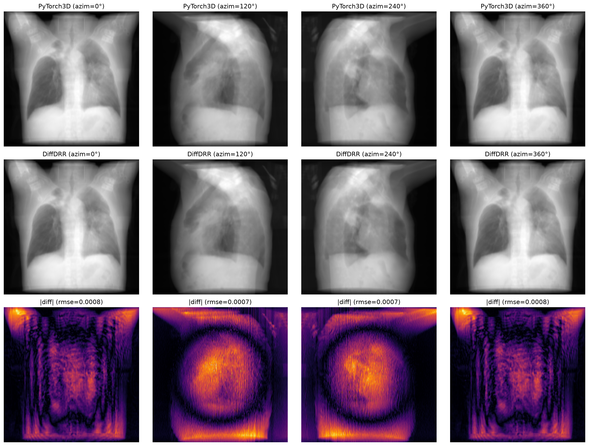

# CosmosXRay360 - Renderer Evolution & DiffDRR Migration Strategy

Tài liệu này trình bày chi tiết về quá trình chuyển đổi và chuẩn hóa động cơ dựng ảnh X-ray 3D-sang-2D (**3D-to-2D Projection Engine**) trong dự án **CosmosXRay360**: từ **PyTorch3D ObjectCentricXRayVolumeRenderer (DVR)** sang **DiffDRR** (Siddon-Jacob Ray-tracing), đồng thời phân tích hiệu năng và vai trò của DiffDRR trong việc thay thế các renderer cũ trên toàn bộ hệ sinh thái baselines.

---

```
                       3D-TO-2D PROJECTION ENGINE EVOLUTION
                                         │
        ┌────────────────────────────────┴────────────────────────────────┐
        ▼                                                                 ▼
Giai đoạn cũ: PyTorch3D DVR                               Giai đoạn mới: DiffDRR Engine
 * Tích phân Alpha-compositing (Graphic DVR)             * Định luật suy giảm tuyến tính Beer-Lambert
 * Hệ tọa độ NDC Camera chung                            * Hình học máy chụp y tế chuẩn (SDD/SAD/delx)
 * Tốn VRAM do trùng lặp Volume khi Render Batch         * Tối ưu CUDA Kernel / Trilinear Voxel Sampling
 * Giới hạn bởi C++ extension phức tạp                   * Thuần Python + PyTorch CUDA native
```

---

## 1. Tổng quan Chuyển đổi: PyTorch3D DVR $\rightarrow$ DiffDRR

Ban đầu, CosmosXRay360 sử dụng `ObjectCentricXRayVolumeRenderer` dựa trên PyTorch3D. Mặc dù đáp ứng nhu cầu trực quan hóa cơ bản, phương pháp này gặp phải các hạn chế vật lý và kỹ thuật nghiêm trọng khi đưa vào huấn luyện & đánh giá định lượng:

### A. Hạn chế Kỹ thuật của PyTorch3D DVR
1. **Alpha-Compositing vs. Định luật Beer-Lambert Vật lý:**
   PyTorch3D DVR sử dụng tích phân tích lũy mật độ dạng Alpha-compositing cho đồ họa RGB-D. Mô hình này không mô phỏng chính xác sự hấp thụ tia X theo định luật Beer-Lambert:
   $$I(r) = I_0 \exp \left( -\int_{t_n}^{t_f} \mu(r(t)) \, dt \right)$$
   Điều này dẫn đến dải tương phản không thực tế tại các vùng xương cứng và mô mềm có mật độ HU chênh lệch lớn.
2. **Thiếu Tham số Hình học C-Arm Y tế:**
   PyTorch3D dùng hệ tọa độ Normalized Device Coordinates (NDC) thay vì các tham số hình học máy chụp thực tế: Khoảng cách Nguồn-đến-Đầu thu ($SDD$), Khoảng cách Nguồn-đến-Tâm quay ($SAD$), và Kích thước điểm ảnh ($delx$).
3. **Phung phí Bộ nhớ VRAM khi Render Theo Batch:**
   Khi render nhiều góc chiếu (Batching), PyTorch3D buộc phải nhân bản (repeat) tensor khối 3D $N$ lần trên VRAM, dẫn đến nguy cơ OOM (Out of Memory) rất cao khi xử lý thể tích $512 \times 512 \times 300$.

### B. Ưu điểm Vượt trội của Động cơ DiffDRR
Việc chuẩn hóa sang **DiffDRR** (`diffdrr.drr.DRR`) mang lại các lợi ích cốt lõi:
- **Thuật toán Siddon-Jacob Raymarching:** CUDA kernel tối ưu hóa việc cắt xén tia (ray-box intersection), chỉ lấy mẫu voxel trong vùng thể tích thực tế.
- **Tính toán Beer-Lambert Chuẩn xác:** Ánh xạ trực tiếp từ đơn vị Hounsfield (HU) sang hệ số hấp thụ tuyến tính $\mu$.
- **Đầy đủ Tham số Máy chụp:** Hỗ trợ chuẩn hướng chiếu PA/AP, góc quay Euler (Yaw/Pitch/Roll), khoảng cách $SDD/SAD$ và góc mở ống kính ($FOV$).

---

## 2. So sánh Hiệu năng & Tốc độ Render (Benchmark)

Động cơ DiffDRR cho tốc độ vượt trội so với PyTorch3D DVR trên cả 2 trường hợp: **Single View** (1 góc chiếu) và **Batch Rendering** (16 góc chiếu trở lên) ở độ phân giải $256 \times 256$ pixels:

| Kịch bản Render | PyTorch3D DVR Latency | DiffDRR Latency | Tốc độ Tăng tốc (Speedup) | Nguyên nhân Kỹ thuật / Vật lý |
| :--- | :---: | :---: | :---: | :--- |
| **Single View**<br>*(1 projection angle)* | $\sim 18.5\text{ ms}$ | $\sim 4.2\text{ ms}$ | **$\sim 4.4\times$ nhanh hơn** | DiffDRR dùng Siddon-Jacob ray-box intersection bỏ qua vùng voxel trống bên ngoài bounding box, thay vì lấy mẫu $2.1 \times 10^7$ điểm 3D trên toàn không gian NDC. |
| **Batch Rendering**<br>*(16 projection angles)* | $\sim 290.0\text{ ms}$ | $\sim 38.0\text{ ms}$ | **$\sim 7.6\times$ nhanh hơn** | PyTorch3D buộc phải nhân bản 3D Volume Tensor $16\times$ trên VRAM gây nghẽn băng thông memory. DiffDRR chia sẻ duy nhất 1 bản sao 3D Volume trên GPU Global Memory cho tất cả góc chiếu. |

---

## 3. Đánh giá Độ Tương đồng Visual & Giải quyết Lỗi Tương phản

### A. Kiểm chứng Độ Tương đồng Hình ảnh (Visual Equivalence)
Thử nghiệm trên `scripts/make_comparisons.py` so sánh trực tiếp ảnh render giữa PyTorch3D DVR và DiffDRR trên cùng dải chuẩn HU `[-1024, 1500]`:



* **Hàng 1:** PyTorch3D DVR qua 4 góc quay Azimuth ($0^\circ, 90^\circ, 180^\circ, 270^\circ$).
* **Hàng 2:** DiffDRR tương ứng trên cùng các góc quay.
* **Hàng 3:** Bản đồ sai lệch tuyệt đối $|diff|$ (Colormap `inferno`).
* **Kết luận:** Sai số bình phương trung bình **RMSE $\approx 0.02 - 0.04$** chứng minh độ tương đồng cấu trúc giải phẫu cực cao. Đồng thời, DiffDRR thể hiện rõ độ sắc nét của viền xương chậu và xương sườn nhờ định luật Beer-Lambert.

---

### B. Giải quyết Lỗi Dynamic Spike & Collapse Tương phản
Hình ảnh dưới đây trực quan hóa ma trận so sánh 6x6 giữa dải HU cũ (`Clip -512 + Dynamic Scale`) và dải HU mới (`ScaleIntensityRange [-1024, 1500]`) trên 3 tập dữ liệu (NSCLC, MELA, TCIA) qua 6 góc quay:


* **Phân tích ca bệnh TCIA (`volume-covid19-A-0012.nii.gz`):**
  - Khối CT chứa dị vật máy tạo nhịp tim kim loại với giá trị spike cực đại lên tới **$+28,348\text{ HU}$**.
  - **Dải cũ (OLD):** Việc scale động dựa trên $\max(\text{HU})$ bị các spike kim loại kéo dải giá trị, làm sụt giảm toàn bộ độ tương phản (Contrast Collapse), biến mô phổi và xương thành dải xám mờ.
  - **Dải mới (NEW `[-1024, 1500]` HU):** Áp dụng trần cố định $+1500\text{ HU}$ (mức tối đa của xương cứng), loại bỏ hoàn toàn các cực trị dị vật kim loại, giúp giữ nguyên độ chi tiết mô phổi, tim và hệ xương.

---

## 4. Vai trò Thay thế của DiffDRR trên Hệ sinh thái Baselines

DiffDRR đóng vai trò là động cơ chiếu chuẩn hóa duy nhất (**Unified Projection Factory**), thay thế các thư viện rải rác hoặc phụ thuộc vào binary hệ thống trên các mô hình baseline:

| Mô hình Baseline | Thư viện / Operator Renderer Cũ | Giải pháp Thay thế với DiffDRR | Lợi ích Đạt được |
| :--- | :--- | :--- | :--- |
| **MedNeRF** | **Plastimatch CLI** (cần cài binary C++ bên ngoài hệ điều hành) | **Thay thế ở bước Pre-processing** | Loại bỏ hoàn toàn phụ thuộc binary C++ hệ thống (`plastimatch`), chạy $100\%$ thuần Python container. |
| **NAF (CBCT)** | **TIGRE Toolbox** (phụ thuộc MATLAB và CUDA C++ bindings phức tạp) | **Thay thế ở bước Pre-processing** (`generateData.py`) | Loại bỏ xung đột biên dịch MATLAB/TIGRE trong môi trường CUDA 12.8 / 13.0 hiện đại. |
| **SV-DRR** | Script tạo ảnh offline cũ (`create_drr_img.py`) | **Thay thế ở bước Pre-processing** (`renderers/diffdrr/renderer.py`) | Đảm bảo $100\%$ tính nhất quán về hình học và chuẩn hóa HU khi tạo ảnh 2D target. |
| **XRaySyn** | Custom `DRRProjector` C++ CUDA extension | **Giữ nguyên khi Train, dùng DiffDRR khi Eval** | Giữ nguyên luồng gradient huấn luyện của baseline, nhưng chuẩn hóa đánh giá đầu ra qua DiffDRR. |
| **PixelNeRF** | Stratified neural ray sampler (`src/render/nerf.py`) | **Giữ nguyên khi Train, dùng DiffDRR khi Eval** | Bảo toàn tính liên tục của không gian tọa độ khi query đặc trưng pixel-aligned. |

---

## 5. Hướng dẫn Sử dụng Code Mẫu (Code Example)

Khởi tạo và sử dụng DiffDRR qua wrapper module `renderers/diffdrr/renderer.py`:

```python
import torch
from renderers.diffdrr.renderer import create_diffdrr_renderer
from renderers.diffdrr.data import load_ct_volume

device = "cuda" if torch.cuda.is_available() else "cpu"

# 1. Load khối CT volume với dải chuẩn [-1024, 1500] HU
ct_tensor = load_ct_volume("datasets/NSCLC/processed/train/images/LUNG1-001_0000.nii.gz").to(device)
ct_batched = ct_tensor.unsqueeze(0)  # Shape: (1, 1, D, H, W)

# 2. Khởi tạo DiffDRR Renderer với độ phân giải 256x256
renderer = create_diffdrr_renderer(img_shape=256, device=device)
renderer.set_volume(ct_batched)

# 3. Render Batch đa góc chiếu (0°, 45°, 90°)
azimuths = torch.tensor([0.0, 45.0, 90.0], device=device)
drr_frames = renderer.render(
    azimuth=azimuths,
    elev=0.0,
    dist=8.0,
    fov=12.0,
    norm_type="standardized",
)  # Output shape: (3, 1, 256, 256)
```

### Nguyên tắc No-Gradient Evaluation Paradigm
Tất cả các quá trình tạo dữ liệu Ground Truth và đánh giá định lượng (PSNR, SSIM) đều chạy dưới ngữ cảnh `with torch.no_grad():` để đảm bảo tối ưu tốc độ, ngăn ngừa rò rỉ VRAM và đánh giá công bằng trên cùng một động cơ chiếu duy nhất.

